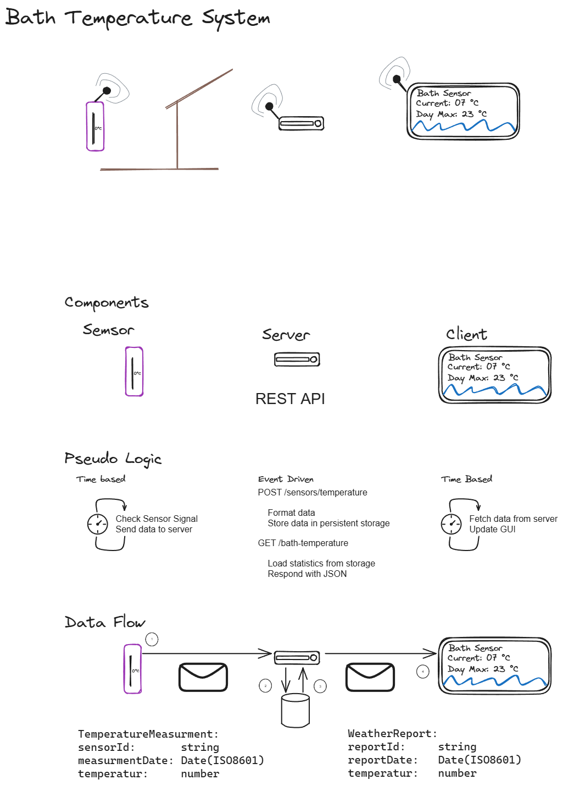

# IoT Sensor Network



## Overview

```sh
.
├── applications            # The source code for the components
│   ├── server              # The web server 
│   ├── static-web-client   # The client
│   └── temperature-sensor  # The sensor
├── deployement             # Description of the system
└── documentation           # Documentation directory
```

## Setup

0. **Prerequisites**
    - [VS Code*]()
    <br>\**Other IDEs might be used, but is not supported*
    - [VS Code Extension - Dev Containers]()
    - [Git]()
    - [Docker Desktop]()

1. Clone the repository to your machine
  
  ```sh
  git clone https://github.com/LarsGJobloop/gruppe-8-iot-sensor-network.git
  ```

3. Run the project with

  ```sh
  docker compose --file deployement/docker-compose.yaml up
  ```

## Technoogies

- Dockerfiles - [Container Technology]()

  Containers are a standardized way of delivering software components, specifically for cloud platforms (aka cloud native). Here we are using Docker containers (Dockerfiles).

- Docker Compose - [Container Orchestration]()

  Distributed systems consists of more than a single component (container), container orchestration software are systems for administering these. We are using Docker Compose for testing these out on our local computer. For large scale/multi node systems we have [Kubernetes/k8s]().

- Dev Containers - [Development Environment]()

  Dev Containers are a description of all the programs required for developing an application. Leading to a standardized setup for the development environment, easing onboarding of new contributors (/switching from one computer to another). For an alternative one might take a look at [NixOS]().
